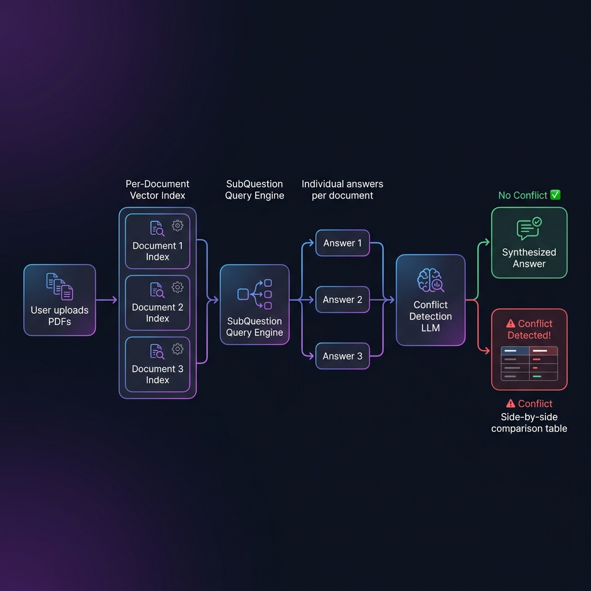
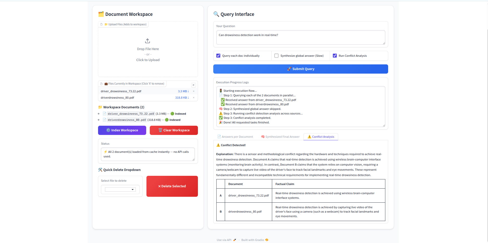
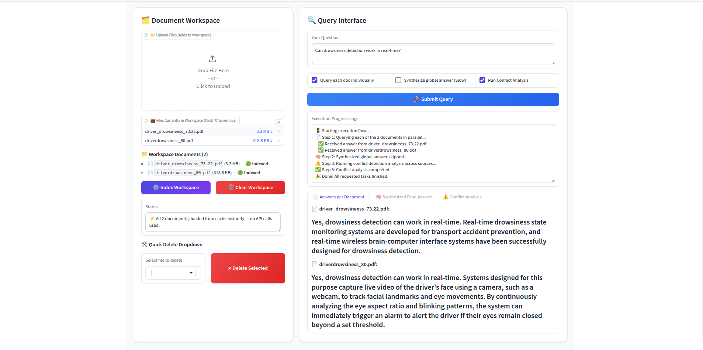

# 📄 MultiDoc RAG — Conflict Detection Across Documents

<div align="center">

**A Retrieval-Augmented Generation system that queries multiple research documents independently, synthesizes a global answer, and automatically flags factual contradictions between sources.**


</div>

---

## 🧠 What Is This Project?

Most AI search tools blend all your documents into a single answer. **That hides the disagreements.**

In medicine, law, science, and finance — knowing *which source says what* and *where sources contradict each other* is often more valuable than a blended summary.

**MultiDoc RAG** solves this. You upload multiple research papers or documents, ask a question, and the system:

1. **Queries each document separately** — preserving individual source attribution
2. **Synthesizes a global answer** — using a SubQuestion Query Engine
3. **Detects contradictions automatically** — using an LLM-powered fact-checker that identifies 5 types of conflicts

> **Example:** You upload two research papers on driver drowsiness detection.  
> Paper A requires an EEG brain sensor and works offline only.  
> Paper B uses a webcam and works in real-time.  
> You ask: *"What hardware is needed for drowsiness detection?"*  
> → **⚠️ Conflict Detected:** Papers describe incompatible hardware requirements.

---

## 🏗️ System Architecture



The pipeline works in three stages:

### Stage 1 — Per-Document Indexing
Each uploaded document gets its own **`VectorStoreIndex`** (a searchable vector database). Documents are never merged — this preserves clean source attribution.

- Text is split into overlapping chunks (1024 tokens, 128 overlap)
- Each chunk is converted to a vector embedding via **Gemini Embedding API**
- The index is persisted to disk so it never needs to be re-embedded

### Stage 2 — Parallel Querying
When you ask a question, the **SubQuestion Query Engine** routes sub-questions to each document index independently. It's like asking the same question to multiple experts simultaneously.

- `Document 1 → Answer 1`
- `Document 2 → Answer 2`
- `Document N → Answer N`

Each answer stays attributed to its source.

### Stage 3 — Conflict Detection
All per-document answers are passed to a **Conflict Detection LLM call** with a specially designed prompt that looks for:

| Conflict Type | Example |
|---|---|
| **Direct** | Paper A says X is true; Paper B says X is false |
| **Capability** | One system works real-time; another is offline-only |
| **Sensor/Method** | One requires EEG headset; another uses only a webcam |
| **Quantitative** | 73% accuracy vs 80% accuracy for "the best approach" |
| **Scope** | Lab-only system vs ready-for-real-world deployment |

---

## ⚡ Conflict Detection — How It Works



The conflict detector does **not** just look for sentences that say "X is wrong."  
Academic papers never say that. Instead, the prompt is designed to detect **implicit incompatibilities** — where two documents lead a reader to completely different conclusions.

The LLM returns a structured response:

```
CONFLICT_FOUND: yes
EXPLANATION: Paper A requires EEG brain signals and is offline-only, while Paper B 
             uses a webcam and works in real-time — incompatible hardware and capability claims.
DOCUMENT_A:  driver_drowsineess_73.22.pdf
DOCUMENT_B:  driverdrowsiness_80.pdf
CLAIM_A:     "The proposed model can only be used for offline analysis. 
              It is not yet ready for online/real-time application."
CLAIM_B:     "The system continuously tracks eye movements using a webcam, 
              triggering an alarm in real-time."
```

This is parsed and displayed in a clean side-by-side comparison table in the UI.

---

## 🛠️ Technology Stack

| Component | Technology | Why This Was Chosen |
|---|---|---|
| **RAG Framework** | [LlamaIndex 0.10.65](https://www.llamaindex.ai/) | Industry-standard framework for building RAG pipelines with per-document indexing and tool-based querying |
| **LLM** | Google Gemini 3.5 Flash | Fast, capable, free-tier accessible. Used for sub-question generation, answer synthesis, and conflict detection |
| **Embeddings** | `models/gemini-embedding-001` | Converts text chunks into semantic vectors for similarity search |
| **Query Engine** | `SubQuestionQueryEngine` (LlamaIndex) | Splits a complex query into targeted sub-questions, one per document — essential for per-source attribution |
| **UI** | [Gradio 4.42](https://gradio.app/) | Rapid Python-native web UI with file upload, streaming output, tabs, and checkboxes |
| **Storage** | Disk-based LlamaIndex cache (`data/cache/`) | Avoids re-embedding on every run — zero API calls for already-indexed documents |

---

## 🔑 Core Concepts Explained

### What Is RAG (Retrieval-Augmented Generation)?

RAG is a technique where an AI doesn't just rely on its training data to answer questions — it **retrieves relevant text from your documents first**, then uses that as context to generate an answer.

```
Traditional AI:  Question → LLM (from training memory) → Answer
RAG:             Question → Search your documents → Relevant chunks → LLM → Grounded Answer
```

This makes answers accurate, attributable, and based on your specific content rather than general knowledge.

### What Is a VectorStoreIndex?

Text cannot be searched mathematically — but numbers can. A **VectorStoreIndex** converts each chunk of your document into a list of numbers (a "vector embedding") that captures its meaning.

When you ask a question, it's also converted to a vector. The system finds the chunks whose vectors are **closest** (most semantically similar) to your question vector — this is "semantic search."

### What Is SubQuestionQueryEngine?

A normal RAG system would merge all documents and find chunks from the whole collection. The SubQuestion engine instead:

1. Generates a sub-question for each document: *"What does Paper A say about X?"*
2. Queries each document's index **separately**
3. Returns individual answers with clear source labels

This is critical for conflict detection — you need to know *which document said what*.

### What Is the Disk Cache?

Embedding a document costs API calls and time. On the first indexing, the system:
1. Embeds all chunks via the Gemini API
2. Saves the vector index to `data/cache/<filename>/`
3. Saves a metadata file with the file's last-modified timestamp

On every subsequent run, it checks the timestamp. If the file hasn't changed → **loads from disk instantly, zero API calls**.

---

## 🚦 Rate Limiter — The Hidden Engineering Challenge



The Google Gemini free tier limits API requests per minute. Because the RAG pipeline queries multiple documents **in parallel** using threads, without a rate limiter it would instantly burst through the quota and get `429 Too Many Requests` errors.

### The Solution: A Thread-Safe Monkeypatch

`rag/rate_limiter.py` intercepts all Gemini API calls before they go out and enforces rate limits:

**Why separate delays?** LLM calls (text generation) and Embedding calls hit **different quota pools** on the Gemini API. The old code used one shared delay — that caused the LLM to get 429 errors even though its quota was separate from embeddings.

```
LLM API:       20s gap between calls  →  max 3 RPM  (chat / complete)
Embedding API: 12s gap between calls  →  max 5 RPM  (embed_content)
```

**True Batch Embedding:** The `genai.embed_content()` API supports a **list of texts in one call**. Instead of waiting 12s × N times (once per chunk), the system sends all N chunks in a single batch call — one 12s wait for the whole batch.

```
Before fix:  20 chunks × 12s = 240 seconds per document
After fix:   2 batches × 12s =  24 seconds per document  (10× faster)
```

**Adaptive Penalty:** After a `429` error, the LLM delay is temporarily increased (+15s) and decays back to normal on each successful call. This prevents hammering the API after quota exhaustion.

**Exponential Backoff:** Retries don't just wait the API-reported delay — they wait `api_delay × (1 + 0.5 × attempt)`, so each successive retry waits progressively longer. Max 6 retries for LLM calls.

---

## 🚀 How to Set Up and Run

### 1. Clone and Create Environment

```bash
git clone https://github.com/yourusername/MultiDocRag.git
cd MultiDocRag

python -m venv .venv
source .venv/bin/activate        # On Windows: .venv\Scripts\activate

pip install -r requirements.txt
```

### 2. Get a Gemini API Key

1. Go to [Google AI Studio](https://aistudio.google.com/)
2. Click **Get API Key** → Create API key
3. Create a `.env` file in the project root:

```env
GOOGLE_API_KEY=your_gemini_api_key_here
```

### 3. Run the App

```bash
python app.py
```

Open your browser at `http://localhost:7861`

---

## 🖥️ How to Use the App

### Step 1 — Upload Documents
- Click **"Upload Files"** and select your PDF or TXT files
- Files accumulate in the workspace (upload from multiple folders one by one)
- The **Workspace Files Status** panel shows each file's indexing status

### Step 2 — Index the Workspace
- Click **"⚙️ Index Workspace"**
- First-time: embeds documents via Gemini API (takes 1–2 min per document on free tier)
- Subsequent runs: loads from disk cache **instantly**

### Step 3 — Ask Questions
Check the query options that suit your need:

| Option | What It Does | Speed |
|---|---|---|
| ✅ Query each doc individually | Retrieves per-source answers | Fast |
| ☐ Synthesize global answer | Runs SubQuestion Engine for a merged answer | Slow (many LLM calls) |
| ✅ Run Conflict Analysis | Checks if sources contradict each other | Moderate |

### Step 4 — Read the Results
Results appear in three tabs:
- **📄 Answers per Document** — what each paper said
- **🧠 Synthesized Final Answer** — merged global answer
- **⚠️ Conflict Analysis** — conflict flag + side-by-side comparison table

---

## 💡 Best Questions to Ask (for Conflict Detection)

Questions that work best are ones where documents are **likely to disagree**:

```
What hardware or sensor is required for drowsiness detection?
Can the system work in real-time?
What is the accuracy of the proposed approach?
What method is used — deep learning or rule-based?
Is the system ready for real-world deployment?
```

> **Pro tip:** Questions about **requirements, accuracy numbers, real-time capability, and deployment readiness** almost always surface conflicts across research papers.

---

## 📁 Project Structure

```
MultiDocRag/
├── app.py                     # Gradio UI + event handlers + main orchestration
├── rag/
│   ├── __init__.py            # Auto-imports rate_limiter on package load
│   ├── rate_limiter.py        # Thread-safe API rate limiter (monkeypatch)
│   ├── indexer.py             # Per-document VectorStoreIndex + disk cache
│   ├── query_engine.py        # SubQuestionQueryEngine builder
│   └── conflict_detector.py   # LLM conflict detection prompt + parser
├── data/
│   ├── docs/                  # Place your PDFs/TXTs here
│   └── cache/                 # Auto-generated disk cache (one folder per file)
├── docs/
│   └── images/                # README diagrams
├── requirements.txt
└── .env                       # Your GOOGLE_API_KEY (never commit this)
```

---

## 📦 Requirements

```
llama-index==0.10.65
llama-index-llms-gemini==0.2.0
llama-index-embeddings-gemini==0.1.8
gradio==4.42.0
python-dotenv==1.0.1
pypdf==4.3.1
sentence-transformers==3.0.1
pydantic==2.10.6
starlette<1.0.0
```

---

## 🌍 Real-World Use Cases

| Domain | Scenario | Value |
|---|---|---|
| 🏥 **Medical Research** | Compare 5 clinical trials on the same drug | Surfaces conflicting dosage or efficacy claims |
| ⚖️ **Legal** | Review multiple expert witness reports | Flags contradictory statements automatically |
| 📈 **Finance** | Compare analyst reports on a stock | Shows where price targets or forecasts conflict |
| 🎓 **Academic** | Literature review across 10+ papers | Maps which papers agree and which contradict |
| 🏛️ **Policy** | Compare WHO vs CDC guidelines | Highlights where international bodies disagree |

---

## 🔮 Future Improvements

- [ ] Confidence score per per-document answer
- [ ] Visual agreement/disagreement graph between documents
- [ ] Export conflict report as PDF
- [ ] Support `.docx` and `.csv` file formats
- [ ] Async parallel querying for faster multi-document queries
- [ ] Multi-conflict detection (more than 2 conflicting sources)

---

## 📄 License

MIT — free to use, modify, and distribute.
